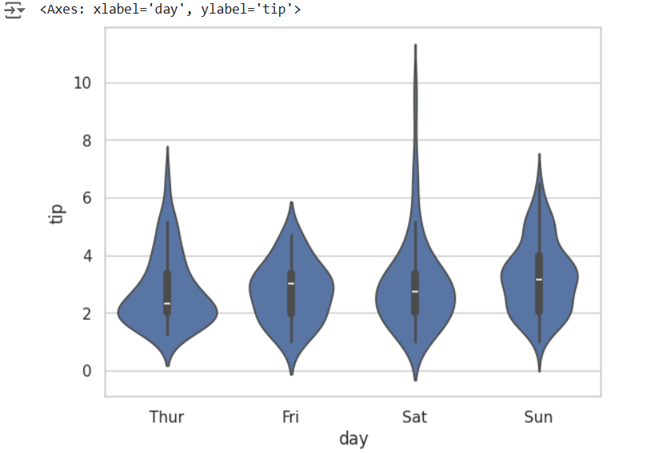
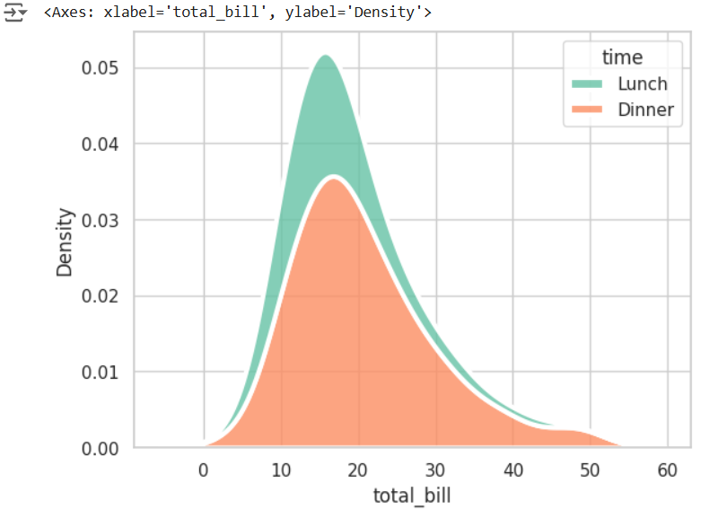

# EXNO-6-DS-DATA VISUALIZATION USING SEABORN LIBRARY
# Name: Ashwin Akash M
# Reference Number: 212223230024
# Department: Artificial Intelligence And Data Science
# Aim:
  To Perform Data Visualization using seaborn python library for the given datas.

# EXPLANATION:
Data visualization is the graphical representation of information and data. By using visual elements like charts, graphs, and maps, data visualization tools provide an accessible way to see and understand trends, outliers, and patterns in data.

# Algorithm:
STEP 1:Include the necessary Library.

STEP 2:Read the given Data.

STEP 3:Apply data visualization techniques to identify the patterns of the data.

STEP 4:Apply the various data visualization tools wherever necessary.

STEP 5:Include Necessary parameters in each functions.

# Coding and Output:
```
import seaborn as sns
import matplotlib.pyplot as plt
x=[1,2,3,4,5]
y=[3,6,2,7,1]
sns.lineplot(x=x,y=y)
```

```
df=sns.load_dataset("tips")
df
```

```
sns.lineplot(x="total_bill",y="tip",data=df,hue="sex",linestyle="solid",legend="auto")
```

```
x=[1,2,3,4,5]
y1=[3,5,2,6,1]
y2=[1,6,4,3,8]
y3=[5,2,7,1,4]
sns.lineplot(x=x,y=y1)
sns.lineplot(x=x,y=y2)
sns.lineplot(x=x,y=y3)
plt.title("Multi-Line Plot")
plt.xlabel("X Label")
plt.ylabel("Y Label")
```

```
tips=sns.load_dataset('tips')
avg_total_bill=tips.groupby('day')['total_bill'].mean()
avg_tip=tips.groupby('day')['tip'].mean()
plt.figure(figsize=(8,6))
p1=plt.bar(avg_total_bill.index,avg_total_bill,label='Total Bill')
p2=plt.bar(avg_tip.index,avg_tip,bottom=avg_total_bill,label='Tip')
plt.xlabel('Day of the Week')
plt.ylabel('Amount')
plt.title('Average Total Bill and Tip by Day')
plt.legend()
```

```
avg_total_bill=tips.groupby('time')['total_bill'].mean()
avg_tip=tips.groupby('time')['tip'].mean()
p1=plt.bar(avg_total_bill.index,avg_total_bill,label='Total Bill',width=0.4)
p2=plt.bar(avg_tip.index,avg_tip,bottom=avg_total_bill,label='Tip',width=0.4)
plt.xlabel('Day of the Week')
plt.ylabel('Amount')
plt.title('Average Total Bill and Tip by Day')
plt.legend()
```

```
years=range(2000,2012)
apples=[0.895,0.91,0.919,0.926,0.929,0.931,0.934,0.936,0.937,0.9375,0.9372,0.939]
oranges=[0.962,0.941,0.930,0.923,0.918,0.908,0.907,0.904,0.901,0.898,0.9,0.896]
plt.bar(years,apples)
plt.bar(years,oranges,bottom=apples)
```

```
dt=sns.load_dataset('tips')
sns.barplot(x='day',y='total_bill',hue='sex',data=dt,palette='Set1')
plt.xlabel('Day of the Week')
plt.ylabel('Total Bill')
plt.title('Total Bill by Day and Gender')
```

```
import pandas as pd
df=pd.read_csv("titanic_dataset (1).csv")
df
```

```
plt.figure(figsize=(8,5))
sns.barplot(x='Embarked',y='Fare',data=df,palette='rainbow')
plt.title('Fare of Passenger by Embarked Town')
```

```
plt.figure(figsize=(8,5))
sns.barplot(x='Embarked',y='Fare',data=df,palette='rainbow',hue='Pclass')
plt.title('Fare of Passengers by Embarked Town,Divided by Class')
```

```
tips=sns.load_dataset('tips')
sns.scatterplot(x='total_bill',y='tip',hue='sex',data=tips)
plt.xlabel('Total Bill')
plt.ylabel('Tip Amount')
plt.title('Scatter Plot of Total Bill vs Tip Amount')
```

```
import seaborn as sns
import numpy as np
import pandas as pd
np.random.seed(1)
num_var=np.random.randn(1000)
num_var=pd.Series(num_var,name="Numerical variable")
num_var
```

```
sns.histplot(data=num_var,kde=True)
```

```
sns.histplot(data=df,x="Pclass",hue="Survived",kde=True)
```

```
np.random.seed(0)
marks=np.random.normal(loc=70,scale=10,size=100)
marks
```

```
sns.histplot(data=marks,bins=10,kde=True,stat='count',cumulative=False,multiple='stack',element='bars',palette='Set1',shrink=0.7)
plt.xlabel('Marks')
plt.ylabel('Density')
plt.title('Histogram of Students Marks')
```

```
tips=sns.load_dataset('tips')
sns.boxplot(x=tips['day'],y=tips['total_bill'],hue=tips['sex'])
```

```
sns.boxplot(x='day',y='total_bill',hue='smoker',data=tips,linewidth=2,width=0.6,boxprops={'facecolor':'lightblue','edgecolor':'darkblue'},whiskerprops={'color':'black','linestyle':"--",'linewidth':1.5},capprops={"color":"black","linestyle":"--","linewidth":1.5})
```

```
sns.boxplot(x="Pclass",y='Age',data=df,palette='rainbow')
plt.title("Age by Passenger Class, TITANIC")
```

```
sns.violinplot(x="day",y="total_bill",hue="smoker",data=tips,linewidth=2,width=0.6,palette="Set3",inner="quartile")
plt.xlabel("Day of the Week")
plt.ylabel("Total Bill")
plt.title("Violin Plot Of Total Bill by Day and Smoker Status")
```

```
sns.set(style='whitegrid')
tip=sns.load_dataset('tips')
sns.violinplot(x='day',y='tip',data=tip)
```

```
sns.set(style='whitegrid')
tip=sns.load_dataset('tips')
sns.violinplot(x=tip["total_bill"])
```

```
sns.set(style='whitegrid')
tips=sns.load_dataset('tips')
sns.violinplot(x='tip',y='day',data=tip)
```

```
sns.kdeplot(data=tips,x='total_bill',hue='time',multiple='fill',linewidth=3,palette='Set2',alpha=0.8)
```

```
sns.kdeplot(data=tips,x='total_bill',hue='time',multiple='stack',linewidth=3,palette="Set2",alpha=0.8)
```

```
sns.kdeplot(data=tips,x='total_bill',hue='time',multiple='layer',linewidth=3,palette="Set2",alpha=0.8)
```

```
mart=pd.read_csv("supermarket.csv")
mart
```

```
mart=mart[['Gender','Payment','Unit price','Quantity','Total','gross income']]
mart.head(10)
```

```
sns.kdeplot(data=mart,x='Total')
```

```
sns.kdeplot(data=mart,x='Unit price')
```

```
sns.kdeplot(data=mart)
```

```
sns.kdeplot(data=mart,x='Total',hue='Payment',multiple='stack')
```

```
sns.kdeplot(data=mart,x='Total',hue='Payment',multiple='stack',linewidth=5,palette='Dark2',alpha=0.5)
```

```
sns.kdeplot(data=mart,x='Unit price',y='gross income')
```

```
data=np.random.randint(low=1,high=100,size=(10,10))
print("The data to be plotted:\n")
print(data)
```

```
sns.heatmap(data=data,annot=True)
```

```
sns.heatmap(data=data)
```

```
tips=sns.load_dataset('tips')
numeric_cols=tips.select_dtypes(include=np.number).columns
corr=tips[numeric_cols].corr()
sns.heatmap(corr,annot=True,cmap='plasma',linewidth=0.5)
```

# Result:
Hence, DATA VISUALIZATION USING SEABORN LIBRARY is executed successfully
